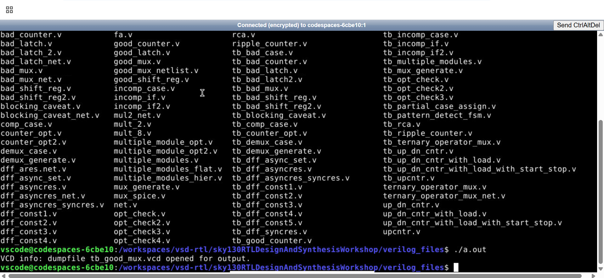
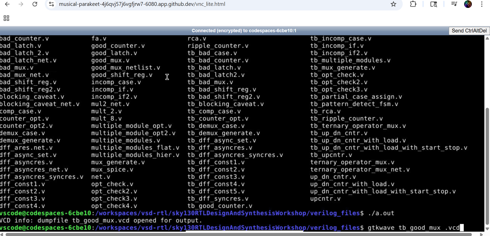
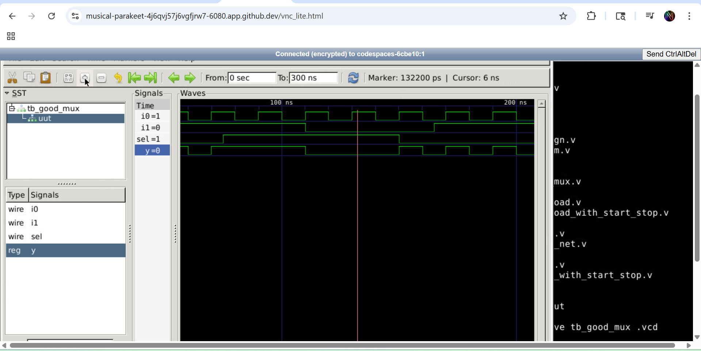
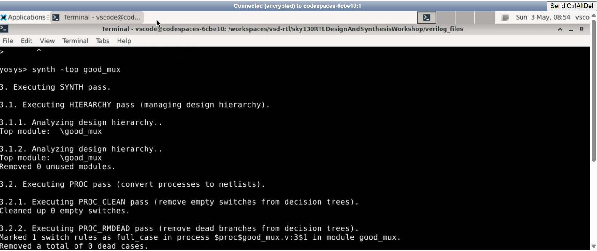
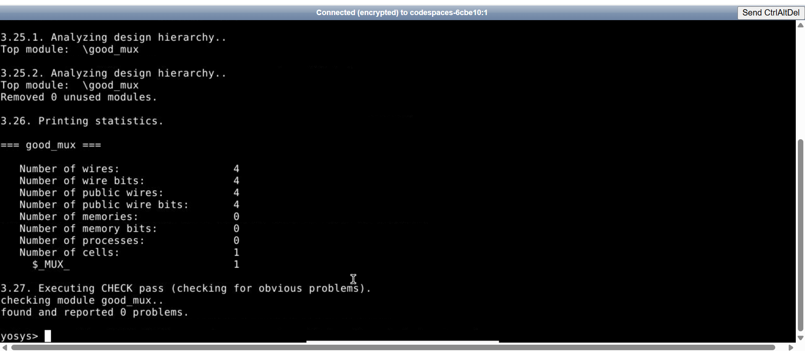
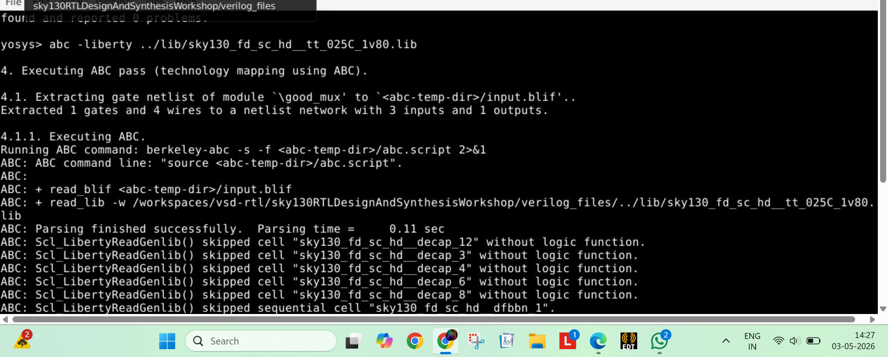
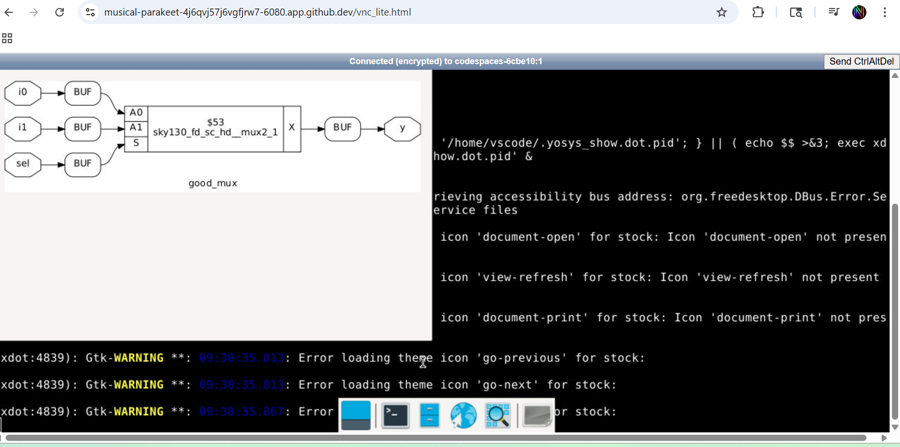
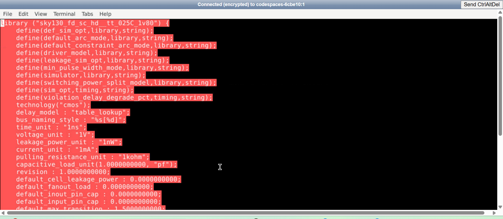
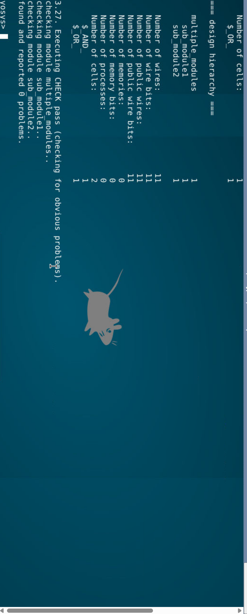

# FPGA_Internship_screening
# Module 1 - Introduction to to Verilog RTL Design And synthesis
## introduction to open-source simulator iverilog
## Labs using Iverilog abd gtkwave
codes used
```bash
iverilog -o good_mux.vvp good_mux.v tb_good_mux.v
./a.out
gtkwave tb_good_mux.vcd
```




---
## Introduction to Yosys and logic Synthesis
## Labs using Yosys and sky130PDKs
Codes used
``` bash
yosys> read_liberty -lib lib/sky130_fd_sc_hd__tt_025C_1v80.lib
yosys> read_verilog dff_asyncres.v
yosys> synth -top dff_asyncres
yosys> abc -liberty lib/sky130_fd_sc_hd__tt_025C_1v80.lib
yosys> show
```






---
## Module 2- Timing libs, hierichal vs flat synthesis and efficient flop coding styles
### Introduction to timing.lib
```bash
# Open the library file using the leaf text editor
gvim lib/sky130_fd_sc_hd__tt_025C_1v80.lib
```


```bash
# Check the files in the directory
ls

# View the design to see the hierarchy
gvim multiple_modules.v
# Start Yosys
yosys

# Read library and design files
yosys> read_liberty -lib lib/sky130_fd_sc_hd__tt_025C_1v80.lib
yosys> read_verilog multiple_modules.v

# Synthesize the top-level module
yosys> synth -top multiple_modules

# Map to the library
yosys> abc -liberty lib/sky130_fd_sc_hd__tt_025C_1v80.lib

# View the hierarchy
yosys> show multiple_modules
yosys> write_verilog -noattr trans_hier.v
```



```bash
read_liberty -lib lib/sky130_fd_sc_hd__tt_025C_1v80.lib

read_verilog multiple_modules.v

synth -top multiple_modules

flatten

abc -liberty lib/sky130_fd_sc_hd__tt_025C_1v80.lib

show
```


